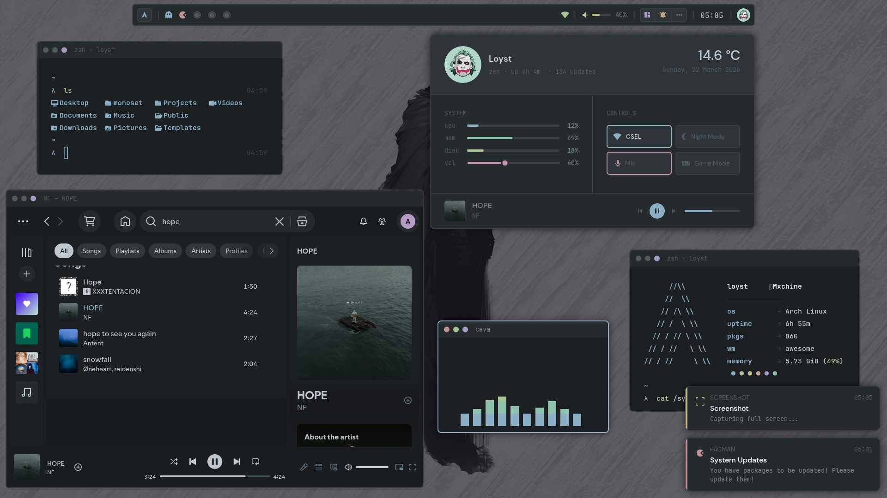

<h1 align="center">stash 🍚 — rice collection</h1>
 
<p align="center">
  
</p>
 
<p align="center">
  
  
  
  
  
</p>
 
> [!IMPORTANT]
> Awesome WM config coming soon. More rices on the way.


## Setup

+ **OS**      — arch linux
+ **WM**      — awesome wm
+ **Shell**   — zsh
+ **Term**    — wezterm
+ **Editor**  — neovim + zed
+ **Browser** — zen
+ **Fetch**   — fastfetch
+ **Prompt**  — oh-my-posh
+ **Comp**    — picom
+ **Music**   — spotify + amberol
 
## Rices
 
| <b>SlateDust — AwesomeWM</b> |
| --- |
| <a href="https://github.com/l0yst/stash/tree/slatedust"></a> |
 
## Structure
 
```
stash/                          ← main branch
├── assets/
│   ├── github/                 ← covers and screenshots
│   ├── wallpapers/             ← wallpapers used across setups
│   └── pfp/                    ← profile pictures
├── scripts/
│   ├── cleaner.sh              ← interactive arch system cleanup
│   └── ultimate-mode.sh        ← toggle max performance mode 
├── system/
│   ├── grub                    ← grub config (edit before using — hardware specific)
│   ├── 99-performance.conf     ← sysctl tweaks → /etc/sysctl.d/
│   ├── timeout.conf            ← systemd timeout → /etc/systemd/system.conf.d/
│   └── ly/
│       └── config.ini          ← ly display manager with SlateDust colors
└── README.md

```
 
> [!NOTE]
> All rices are free to use — just credit me. Found a bug or want something added? [open an issue](https://github.com/l0yst/stash/issues).
 
<p align="center">
  <sub>✨ l0yst · built on arch linux</sub>
</p>

## License
 
MIT — see [LICENSE](LICENSE)
